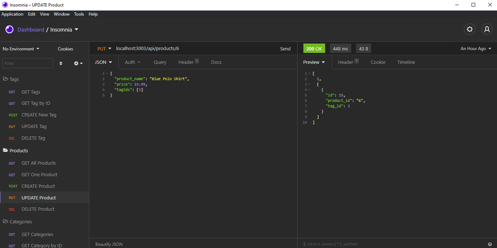

# E-Commerce Back End

## Description

E-Commerce is the platform of choice for the electronics industry. Having a way to sell your goods online is the best way to position your business for success.

With this E-Commerce Back End, you'll have everything you need on the server-side to get started. You'll be able to create categories to organize your goods, create tags to display products that have aspects in common, and you can create your products, of course. You can test your information with an API platform like Insomnia or Postman.

Ready to start your internet retail empire?

This application was written in JavaScript for Node.js using Express.js, Sequelize, and MySQL.

## Table of Contents

* [Description](#description)
* [Installation](#installation)
* [Usage](#usage)
* [Credits](#credits)
* [License](#license)

## Installation

To install the application's dependencies, type the following:
```md
npm install
```
To seed the database after you've added the schema.sql to your MySQL Workbench, type the following:
```md
npm run seed
```
Lastly, to start the server, type the following:
```md
npm start
```
Once those steps are done, you can view the application in Insomnia or your browser using localhost:3003 and the desired api routes.

## Usage

Navigate to [part one of the video](https://youtu.be/-rA9ZzXnZlA) to view a walkthrough on how the application works.

Continue to [video two](https://youtu.be/br0TkcyK5vE) for the rest of the walkthrough.

* Get current categories, including a category by ID.
* Create a category, then update and delete it.
* Get all current products, then a single product.
* Create a product, then update and delete it.
* Get all current tags, then a single tag.
* Create a tag, then update and delete it.



## Credits

Created by [Sarah Makela](https://github.com/smakela13).

## License

This website currently has No License, which means it is under exclusive copyright. No one can copy, distribute, or modify this website without permission.